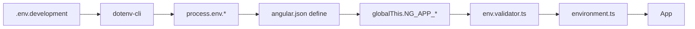

# 🔐 Configuração de Variáveis de Ambiente

Este projeto usa arquivos `.env` para gerenciar variáveis de ambiente com **validação type-safe** usando Zod.

---

## 📋 Quick Start

### 1. Copiar arquivo de exemplo

```bash
# Development
cp .env.example .env.development

# Production
cp .env.example .env.production
```

### 2. Configurar valores

Edite `.env.development` ou `.env.production` com seus valores:

```env
NG_APP_API_URL=http://localhost:8080/api/v1
NG_APP_TENANT_SLUG=public
NG_APP_OAUTH_REDIRECT_URI=http://localhost:4200/auth/callback
```

### 3. Executar aplicação

```bash
npm start                  # development mode
npm run start:prod         # production mode
npm run build              # build production
npm run build:dev          # build development
```

---

## 🔑 Variáveis Disponíveis

| Variável | Descrição | Exemplo | Validação |
|----------|-----------|---------|-----------|
| `NG_APP_API_URL` | URL base da API (sem trailing slash) | `http://localhost:8080/api/v1` | URL válida, sem `/` final |
| `NG_APP_TENANT_SLUG` | Slug do tenant (multi-tenancy) | `public` ou `acme` | Alfanumérico lowercase + hífens |
| `NG_APP_OAUTH_REDIRECT_URI` | URI de callback OAuth | `http://localhost:4200/auth/callback` | URL absoluta válida |

---

## ✅ Validação com Zod

Todas as variáveis são validadas **em tempo de build** usando Zod (`src/environments/env.validator.ts`).

### Comportamento

- **❌ FAIL-FAST**: Build falha imediatamente se variável inválida/ausente
- **✅ TYPE-SAFE**: TypeScript conhece os tipos exatos
- **📋 MENSAGENS CLARAS**: Erros detalhados indicam o problema

### Exemplo de Erro

```bash
━━━━━━━━━━━━━━━━━━━━━━━━━━━━━━━━━━━━━━━━
❌ ERRO DE CONFIGURAÇÃO DE AMBIENTE
━━━━━━━━━━━━━━━━━━━━━━━━━━━━━━━━━━━━━━━━

As seguintes variáveis de ambiente são inválidas:

  ❌ apiUrl: API_URL não deve terminar com /
  ❌ tenantSlug: TENANT_SLUG deve conter apenas letras minúsculas, números e hífens

Verifique os arquivos .env.development ou .env.production
e consulte .env.example para referência.
━━━━━━━━━━━━━━━━━━━━━━━━━━━━━━━━━━━━━━━━
```

---

## 🏗️ Como Funciona

### 1. Arquivos `.env`

```
.env.development    → Desenvolvimento (local)
.env.production     → Produção
.env.example        → Template (versionado no Git)
```

### 2. Fluxo de Build



1. **dotenv-cli** carrega `.env.development` → `process.env`
2. **angular.json** define mapeia `process.env.*` → `globalThis.NG_APP_*`
3. **env.validator.ts** valida e tipifica variáveis
4. **environment.ts** exporta objeto validado
5. **App** usa `environment.apiUrl` com type-safety

### 3. Validação (Zod)

```typescript
// src/environments/env.validator.ts
const envSchema = z.object({
  production: z.boolean(),
  apiUrl: z.string().url().refine(url => !url.endsWith('/')),
  tenantSlug: z.string().regex(/^[a-z0-9-]+$/),
  oauthRedirectUri: z.string().url()
});

export type Environment = z.infer<typeof envSchema>; // Type-safe!
```

---

## 🚀 Deploy / CI/CD

### Azure DevOps / GitHub Actions

**NÃO comitar `.env.production` com valores reais!**

Use variáveis de ambiente do pipeline:

```yaml
# azure-pipelines.yml
- task: Npm@1
  inputs:
    command: 'custom'
    customCommand: 'run build'
  env:
    NG_APP_API_URL: $(API_URL)
    NG_APP_TENANT_SLUG: $(TENANT_SLUG)
    NG_APP_OAUTH_REDIRECT_URI: $(OAUTH_REDIRECT_URI)
```

### Docker

```dockerfile
# Dockerfile
FROM node:20-alpine AS build

WORKDIR /app
COPY package*.json ./
RUN npm ci

COPY . .

# Variáveis de build
ARG NG_APP_API_URL
ARG NG_APP_TENANT_SLUG
ARG NG_APP_OAUTH_REDIRECT_URI

ENV NG_APP_API_URL=$NG_APP_API_URL
ENV NG_APP_TENANT_SLUG=$NG_APP_TENANT_SLUG
ENV NG_APP_OAUTH_REDIRECT_URI=$NG_APP_OAUTH_REDIRECT_URI

RUN npm run build
```

### Azure Key Vault / AWS Secrets Manager

Para **produção**, use secrets manager:

```bash
# Carregar secrets do Azure Key Vault
export NG_APP_API_URL=$(az keyvault secret show --name api-url --vault-name my-vault --query value -o tsv)
export NG_APP_TENANT_SLUG=$(az keyvault secret show --name tenant-slug --vault-name my-vault --query value -o tsv)

npm run build
```

---

## 🔒 Segurança

### ✅ Boas Práticas

- ✅ `.env.example` versionado (sem valores reais)
- ✅ `.env.development` / `.env.production` no `.gitignore`
- ✅ Secrets de produção em Key Vault / Secrets Manager
- ✅ Validação fail-fast (erro no build se inválido)
- ✅ Prefixo `NG_APP_` (evita expor variáveis sensíveis do servidor)

### ❌ Antipadrões

- ❌ Comitar `.env.production` com tokens/secrets reais
- ❌ Usar variáveis sem prefixo (`API_KEY` → exposto ao frontend!)
- ❌ Desabilitar validação Zod
- ❌ Hardcoded values no código

---

## 🧪 Testing

Para testes, crie `.env.test`:

```bash
# .env.test
NG_APP_API_URL=http://localhost:3000/api/v1
NG_APP_TENANT_SLUG=test
NG_APP_OAUTH_REDIRECT_URI=http://localhost:4200/auth/callback
```

```json
// package.json
{
  "scripts": {
    "test": "dotenv -e .env.test -- ng test"
  }
}
```

---

## 📚 Referências

- **Zod**: https://zod.dev
- **dotenv-cli**: https://www.npmjs.com/package/dotenv-cli
- **Angular Environment**: https://angular.dev/guide/environments
- **12-Factor App**: https://12factor.net/config

---

## ❓ FAQ

### Por que não usar `environment.ts` diretamente?

- **Problema**: Valores hardcoded precisam de rebuild para mudar
- **Solução**: `.env` permite configurar sem rebuild (CI/CD, containers)

### Por que prefixo `NG_APP_`?

- **Segurança**: Apenas variáveis com prefixo são expostas ao frontend
- **Convenção**: Similar ao `REACT_APP_` / `VITE_` / `NEXT_PUBLIC_`

### E se eu esquecer uma variável?

- **Build falha** com mensagem clara indicando qual variável está faltando/inválida
- Fail-fast evita deploy com configuração quebrada

### Posso usar em runtime (SSR)?

- Sim! Para Angular Universal/SSR, carregue `.env` no server via `dotenv` direto no Node.js

---

**🎉 Pronto! Agora você tem configuração type-safe e fail-fast.**

